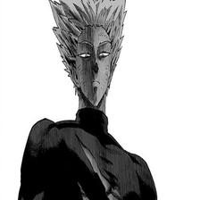
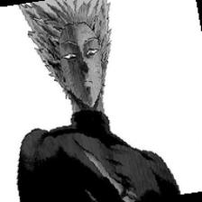
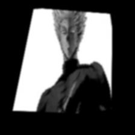

## Домашнее задание №5
### Выполнил: Анненков Арсений Алексеевич

## Задание 1: Стандартные аугментации torchvision
**RandomHorizontalFlip** - зеркалит изображение

**RandomCrop** - случайно отрезает часть изображения

**ColorJitter** - случайно меняет яркость, контраст, насыщенность и цветовую палитру

**RandomRotation** - случайно поворачивает изображение

**RandomGrayscale** - случайно конвертирует изображение в чёрно-белый

## Задание 2: Кастомные аугментации
**RandomBlur** - случайное размытие

**RandomPerspective** - случайное изменение перспективы

**RandomBrightnessContrast** - случайное изменение яркости и контраста

**AddGaussianNoise**(из extra_augs.py) - добавляет гауссов шум к изображению

**Posterize**(из extra_augs.py) - уменьшает количество бит на канал

## Задание 3: Анализ датасета
В каждом классе находится по 30 изображений.

Размеры изображений:

Минимальный размер: **(210, 240)**

Максимальный размер: **(736, 1308)**

Средний размер: **538.89 x 623.56**

## Задание 4: Pipeline аугментаций
В light конфигурации используется RandomHorizontalFlip, в medium к нему добавляются RandomRotation и RandomResizedCrop, а в heavy RandomPerspective и GaussianBlur. Класс AugmentationPipeline объединяет аугментации из конфигурации и применяет их к изображению.

## Задание 5: Эксперимент с размерами
C увеличением размера изображения растёт как время выполнения, так и затрачиваемая память. В первом случае с изображением размером 64x64 выделяется больше памяти, чем у 128х128 из-за того что это первый датасет. В этом случае выделяется больше памяти для создания нужных структур данных.

## Задание 6: Дообучение предобученных моделей
Из графиков следует, что между тестовыми и обучающими показателями есть большая разница. Можно сделать вывод о переобучении или большой разнице между их датасетами.

