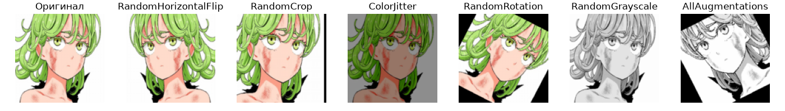
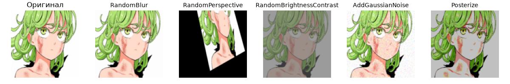
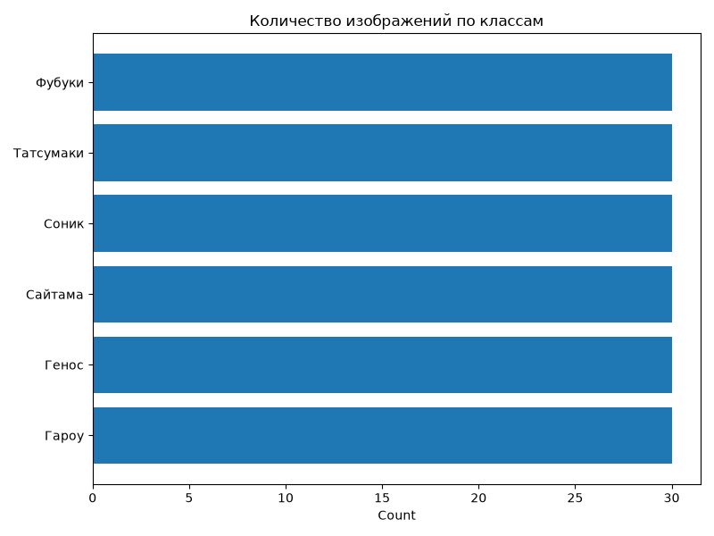
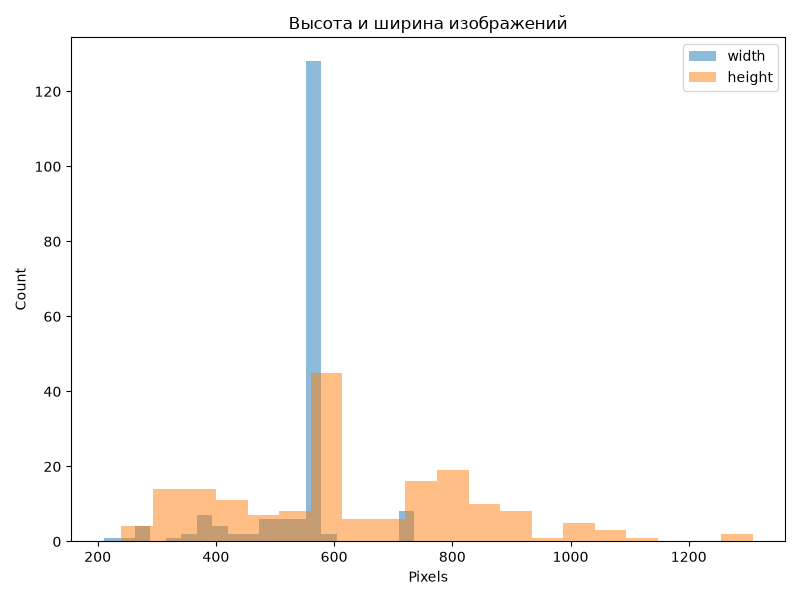
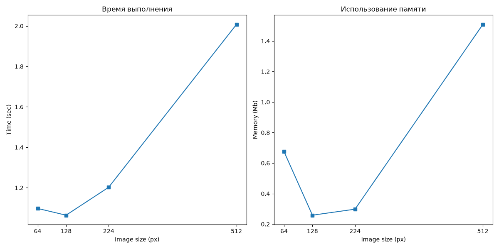
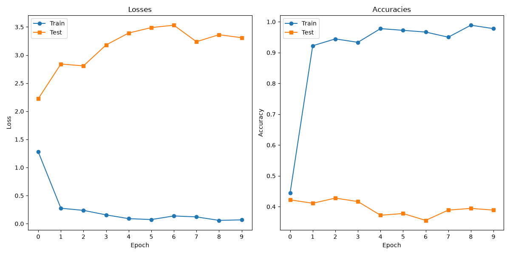

## Домашнее задание №5
### Выполнил: Анненков Арсений Алексеевич

## Задание 1: Стандартные аугментации torchvision

## Задание 2: Кастомные аугментации

## Задание 3: Анализ датасета

## Задание 4: Pipeline аугментаций

## Задание 5: Эксперимент с размерами

## Задание 6: Дообучение предобученных моделей

